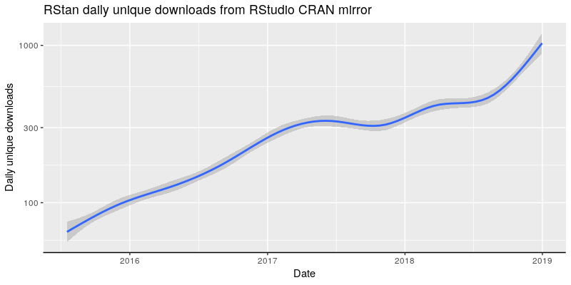

## R and Stan

* This course, like essentially all QMSS courses, uses R as its primary language
* If you have neither used R nor another programming language (e.g. Python, Java, C++)
  this course will be VERY difficult because we do not teach the basics of R since
  QMSS students have already used R for at least one semester
* Homeworks have to be done using RMarkdown (we will explain this)
* Stan is another programming language, which we will learn this semester
* Stan can be accessed from a variety of other [interfaces](http://mc-stan.org/users/interfaces/index.html),
  besides R which you might prefer to use for Bayesian inference after the course is finished 

## Season 3, Episode 9 of Billions

<video width="600" height="480" controls>
  <source src="https://video.twimg.com/ext_tw_video/999106109523742720/pu/vid/640x360/ljdUoEqXji0ES_CV.mp4?tag=3" type="video/mp4">
Your browser does not support the video tag.
</video> 

## Stan Is Trending

## Obligatory Disclosure

* Ben is an employee of Columbia University, which has received several research grants to develop Stan
* Ben is also a manager of GG Statistics LLC, which uses Stan for business purposes
* According to Columbia University 
  [policy](https://research.columbia.edu/content/conflict-interest-and-research), any such employee who 
  has any equity stake in, a title (such as officer or director) with, or is expected to earn at least 
  $\$5,000.00$ per year from a private company is required to disclose these facts in presentations

## Quotes from McElreath (2016, p.3)

- "statistics is neither mathematics nor a science, but rather a branch of engineering"
- "Advanced courses in statistics do emphasize engineering, but most scientists never get that far. Teaching statistics this way is like teaching engineering backwards, starting with bridge building and ending with basic physics."
- "Serious trouble begins when scholars move on to conducting innovative research, pushing the boundaries of their specialties. It's as if we got our hydraulic engineers by promoting plumbers."
- "Why aren’t the tests enough for innovative research? The classical procedures of introductory statistics tend to be inflexible and fragile. By inflexible, I mean that they have very limited ways to adapt to unique research contexts. By fragile, I mean that they fail in unpredictable ways when applied to new contexts."

## Probability

* The analogue of "basic physics" for us is probability: a shared language for communicating about 
  uncertain (sometimes future) propositions
* QMSS does not offer / encourage a probability course such as 
  [GU4203](http://www.columbia.edu/cu/bulletin/uwb/subj/STAT/GU4203-20183-001/)
* To be Bayesian, you have to know / learn probability theory
    1. Probability theory for discrete random variables (starting Thursday)
    2. Probability theory for continuous random variables (in two weeks)
    3. Probability theory for multivariate random variables (near Spring Break)
* To be Bayesian, you have to know a good bit about computer programming
* To be Bayesian, you have to know a good bit about the substance of what you are modeling
* To be Bayesian, you have to be prepared for everyone (even other Bayesians) to disagree with you
    
## Aristotelian (Classical Propositional) Logic

1. All men are mortal
2. Socrates is a man
3. Ergo, Socrates is mortal
* There are zero interesting applications of deductive logic in the social sciences
* The closest is perhaps democratic peace "theory":
    1. No two democracies fight a war against each other
    2. Australia and Germany are democracies
    3. Ergo, Australia and German will not fight a war against each other
* Whether (1) is true depends on how you operationalize "democracy" and "war" so
  the literature has descended into debates over things like whether a country
  is a democracy or whether a conflict they were involved in is a war
* A much better question is: Why are democracies much less likely to fight a war against
  each other compared to wars involving an autocracy?

## Probability as an Extension of Aristotelian Logic

* Various [people](https://arxiv.org/abs/1706.05261) have characterized probability as a 
  weaker form of logic where propositions are not necessarily true or false
* In R and many other programming languages, `TRUE` maps to $1$ and `FALSE` maps to $0$
  for the purpose of doing arithmetic on them. If so, probabilities are the real
  numbers between $0$ and $1$.
* An example from last year
    1. Parties of unpopular presidents TEND to lose seats in US midterm elections
    2. Trump is, and is LIKELY to remain, unpopular
    3. Ergo, the Republicans will PROBABLY lose seats in the $2018$ elections
* None of (1), (2), or (3) is guaranteed, although (3) seems plausible --- to some
  degree --- if you accept both (1) and (2)
* Bayesianism is a school of thought that uses probability to describe the
  degree of belief (with quantified uncertainty) that a proposition is true

## Four Sources of Uncertainty

1. Uncertainty about parameters in models
2. Uncertainty about which model is best
3. Uncertainty about what to do with the output of the (best) model(s)
4. Uncertainty about whether the software works as intended

* Bayesians use probability to describe their uncertainty in (1) and (2)
* The Bayesian approach links with decision theory, which prescribes (3)
* The Stan software does as much as we can to mitigate (4)
* By implication, other approaches / software may refer to probability
  but fail to handle one or more of the above four items
* These include  randomization inference, frequentist inference, supervised 
  learning, and others
    
## Introduction to Randomization Inference

* In the 1920s, Fisher devised a method of inference for experiments where:
    1. The only parameter is the Average Treatment Effect (ATE) for
      the subjects who participate in the experiment
    2. There is no model to speak of
    3. Hard to say what to do with the ATE due, in part, to 
       generalizeability
    4. The (subsequent) implementation in software is simple   

* There are `r format(choose(22, 11))` ways to
  assign $11$ out of $22$ people to treatment
* The researcher choses one of them AT RANDOM
* Randomization of the treatment variable creates the need for probability. Everything after that 
  randomization has a probability distribution that is conditioned on everything before.

## Conclusion of Randomization Inference

* Administer the treatment to those in the treatment group & later measure $Y$
* Estimated ATE is the difference in mean outcomes between these two groups
* What about the difference in means between the OTHER
  `r format(choose(22, 11) - 1L)` ways to
  divide $22$ people into two groups of $11$?
* You might anticipate that the way treatment was ACTUALLY assigned would
  have (among) the largest difference(s) in means between the two groups but
  there is some probability that is not true
* If and only if the true treatment effect is zero then the OTHER
  `r format(choose(22, 11) - 1L)` differences
  in means form a probability distribution of estimated ATEs
* The proportion of these 
  `r format(choose(22, 11))` ATE estimates
  that are greater in magnitude than the actual ATE estimate is the $p$-value
  of a null hypothesis
  
## Frequentist Inference

* In the 1920s, Fisher also devised a method of inference for observational data where
  the goal is to make an inference about a population parameter from a relatively small 
  RANDOM sample from that population
* For example, the British population was about $36$ million at the time and 
  the government might take a sample of $500$. There are $e \approx$ `r exp(1)`
  raised to the power of `r lchoose(36 * 10^6, 500)` ways of doing so.
* The data collector chooses one at random and gives the data to the analyst
  who estimates, for example, the population mean with the sample mean
* What about the other $-1 + e^{6088.1808245}$ OTHER ways that a sample of 
  size $500$ out of $36$ million could have been drawn to estimate the
  population mean?
* The probability distribution of the sample mean estimator over the 
  $e^{6088.1808245}$ ways to draw such a sample can be derived analytically
* In the 1930s, Neyman & Pearson devised a way of testing 2 point
  hypotheses about the population mean and popularized the confidence interval estimator
  
## Quotes from McElreath (2015, p.4&10)

- "The greatest obstacle that I encounter among students and colleagues is the tacit belief that the proper objective of statistical inference is to test null hypotheses"
    - Hypotheses are not models
    - Measurement error prevents deductive falsification
- "Instead, what researchers need is ... a set of principles for designing, building, and refining special-purpose statistical procedures. Every major branch of statistical philosophy possesses such a unified theory. But the theory is never taught in introductory ... courses. So there are benefits in rethinking statistical inference as a set of strategies, instead of a set of pre-made tools."

1. Bayesian data analysis 
2. Multilevel models
3. Model comparison using information criteria

## Bayesian Inference

* Uncertainty creates the need for probability to describe beliefs
* You have beliefs about how much the S&P500 will grow by the end of $2019$
* You express your beliefs with a probability distribution, such as a normal
  distribution with a mean of $+2\%$ and a standard deviation of $5\%$
* As more data comes during $2019$, you update your beliefs about
  where the S&P500 will be at the end of $2019$ to some new probability distribution
* Note the data are not, and need not be, a sample or an experiment for you to
  use probability distributions to describe your beliefs in a rigorous way 

## Supervised Learning

- Suppose there is a dataset of size $N$, which generally is neither an
  experiment nor a sample from any well-defined population so Fisher's
  work doesn't apply
- There are $\frac{N!}{n!\left(N - n\right)!}$ ways to divide this dataset
  into a training dataset of size $n$ and a testing dataset of size $N - n$
- The analyst chooses one split at random, then
    * chooses parameters to minimize some loss function in the training data
    * uses them to predict the outcome in the testing data
    * compares the predictive accuracy to other models
- What about the other $-1 + \frac{N!}{n!\left(N - n\right)!}$ OTHER ways to 
  divide a dataset into training and testing, which could be used to generate a 
  probability distribution over a measure of predictive accuracy.
  Data miners often do not bother.
- Most (but not all) supervised learning ignores all forms of uncertainty

## (Dis)Advantages of Bayesian Inference

- Bayesian inference remains useful in situations other paradigms specialize in:
    - Experiments: What are your beliefs about the ATE after seeing the data?
    - Repeated designs: Bayesian estimates have correct frequentist properties
    - Predictive modeling: If you only care about predictions, use the 
      posterior predictive distribution
- Bayesian inference is very useful when you are using the results to make a decision
  or take an action; other paradigms are not
- Bayesian inference is orders of magnitude more difficult for your computer because
  it is attempting to answer a more ambitious question
- The Bayesian approach is better suited for convincing yourself of something than
  convincing other people

## Different Perspectives on Probability

What is the paradigm?      | What is fixed?                  | What is random?      | What is averaged over?    | What is the conclusion?
------------- | --------------------------------| -------------------- | ----------------------------------| -----------------------
Randomization | ${y_1, y_2, \dots, y_N}$        | Treatment assignment | Hypothetical experiments     | ATE $\neq 0$?
Frequentist   | $Y$, $\boldsymbol{\theta}$, $N$ | Sample inclusion     | Confidence interval catches | Type I error rate is known 
Supervised learning    | ${y_1, y_2, \dots, y_N}$        | Training / testing inclusion   | Loss in the testing data | Some procedure predicts best
Bayesian      | ${y_1, y_2, \dots, y_N}$, $\boldsymbol{\theta}$ | Beliefs about $\boldsymbol{\theta}$ | Functions of posterior draws of $\theta$ \| $y_1, y_2, \dots, y_N$ | Decision or action

## Objectivity and Subjectivity

- Under weak and not particularly controversial assumptions, Bayesian inference is THE objective way
  to update your beliefs about (functions of) $\theta$ in light of new data $y_1, y_2, \dots, y_N$
- Nevertheless, the Bayesian approach is labeled subjective because it does not say what your beliefs about 
  $\theta$ should be before you receive $y_1, y_2, \dots, y_N$
- Thus, if you currently believe something absurd about $\theta$ now, your beliefs about $\theta$ will
  merely be less absurd after updating them with $y_1, y_2, \dots, y_N$
- The big problem is not that people believe wrong things now, but that they do not update their 
  beliefs about $\theta$ according to Bayesian principles when they observe $y_1, y_2, \dots, y_N$
- In fact, in some situations, observing data that contradicts people's previous beliefs makes them
  believe in their wrong beliefs more strongly
- Bayesian principles are also used in formal models, but as an assumption about how people
  should behave rather than a behavioral description
